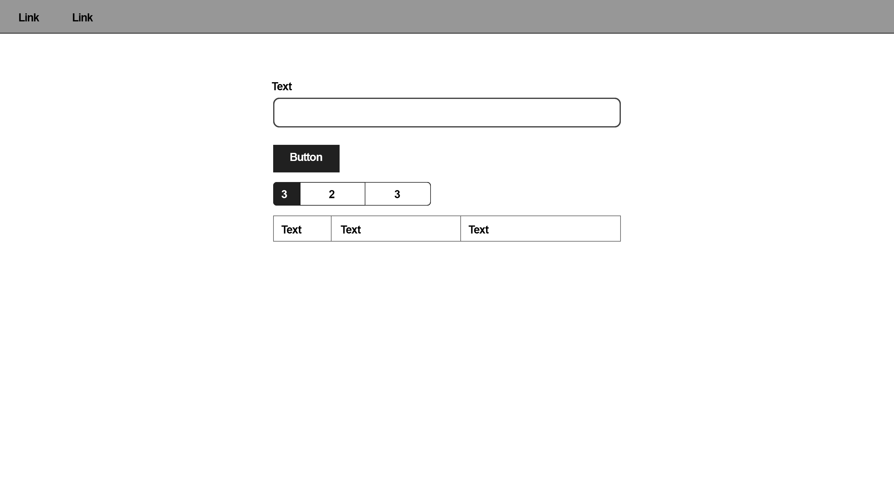
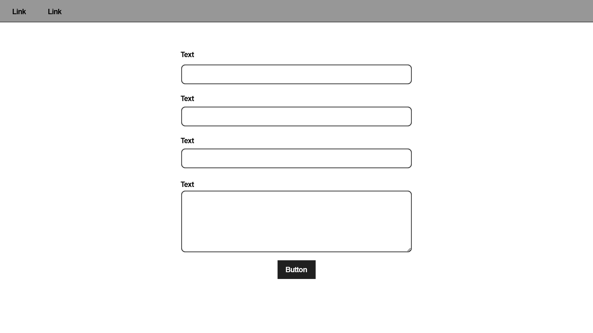
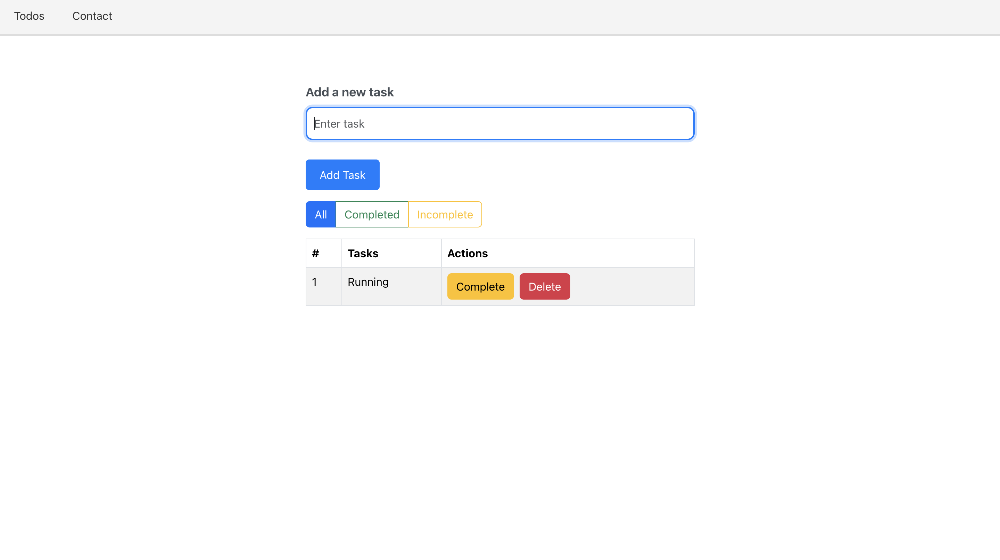
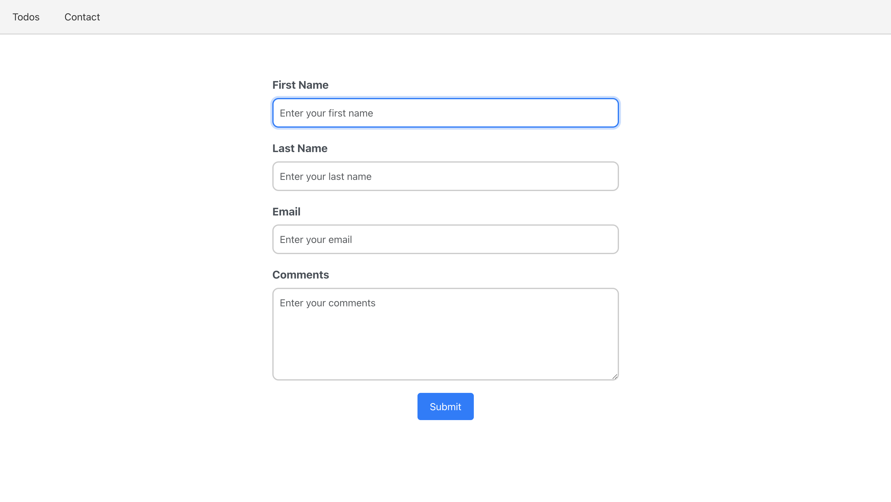

# To-Do Application

## Description

The To-Do List App is a simple, interactive web application built with React. The app allows users to manage tasks by adding, viewing, marking as complete, and deleting to-do items. Users can categorize tasks into completed and incomplete tasks and manage their to-do lists efficiently. The app uses React for state management and Bootstrap for styling to provide a responsive and user-friendly interface.

## Wireframes

## Technologies Used

- CSS
- Bootstrap
- React

## User Stories

1. **As a user**, I want to add tasks to my to-do list so that I can keep track of my work.
2. **As a user**, I want to mark tasks as completed so that I can distinguish between completed and pending tasks.
3. **As a user**, I want to filter my tasks (all, completed, pending) to focus on specific categories.

## Screen Shots

## Next Steps

1. Allow users to **set priorities** for their tasks (e.g., high, medium, low) and sort tasks based on priority.
2. Add a feature for users to **set due dates for tasks** and sort tasks by their due date.
3. Allow users to **categorize tasks (e.g., Work, Personal)** and filter them based on categories.
4. Allow users to **sign in** and have their to-do lists saved to their accounts.

## Author

Deji Taiwo - [@LinkedIn](https://www.linkedin.com/in/taiwo-a-80346223b/)
